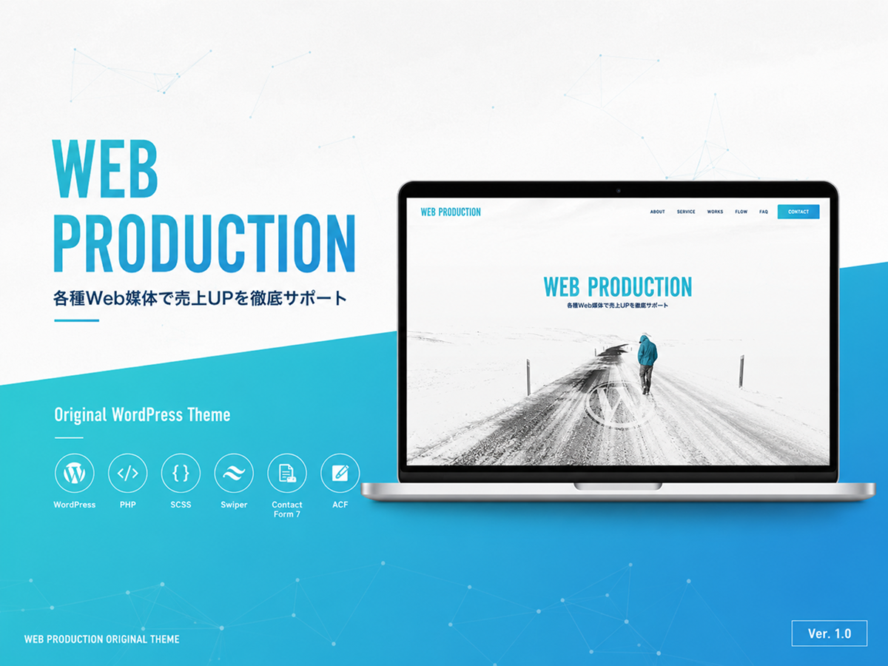

# WordPressオリジナルテーマ（WordPress Original Theme）



## Overview
企業サイトを想定したWordPressオリジナルテーマです。  
デザインからWordPress組み込みまで一貫して実装しています。
保守性・再利用性を重視したBEM設計とSCSSレイヤー設計で構築しています。

## Website
**URL**
- https://dolzap.conohawing.com/lp/

## Features
- WordPressオリジナルテーマ
- カスタム投稿タイプ（制作事例）
- カスタムフィールド
- お問い合わせフォーム
- レスポンシブ対応
- カスタムページ（サンクス・404）
- BEM・FLOCSS（CSS設計）
- SCSSレイヤー設計
- tsParticles（FV背景）
- Swiper（制作事例）

## Plugins
- Advanced Custom Fields
- Contact Form 7
- SEO SIMPLE PACK
- Simple Page Ordering
- WPS Hide Login

## Stack
### Frontend


### Backend


### Infrastructure


### Others


## Directory
```bash
original-theme/
├── assets/
│   ├── css/               # CSS
│   ├── js/                # JavaScript
│   ├── img/               # Images
│   ├── font/              # Fonts
│   └── vendor/            # Libraries
├── src/
│   └── scss/
│       ├── foundation/    # Foundation
│       ├── layout/        # Layout
│       ├── component/     # Components
│       ├── project/       # Project
│       └── style.scss     # Entry Point
├── inc/
│   ├── setup.php          # Theme Setup
│   ├── enqueue.php        # Asset Loader
│   └── common.php         # Common Functions
├── template-parts/
│   ├── layout/            # Layout Parts
│   └── section/           # Section Parts
├── index.php              # Fallback
├── front-page.php         # Front Page
├── page.php               # Default Page
├── page-thanks.php        # Thanks Page
├── 404.php                # 404 Page
├── header.php             # Header
├── footer.php             # Footer
├── functions.php          # Theme Functions
└── style.css              # Theme Information
```

## License
MIT
